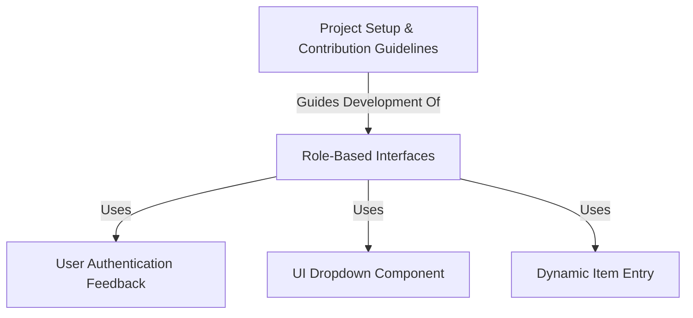

# dil se foodie

**foodly** is a web application built using *PHP and AJAX* primarily for ordering food online.
It also provides separate interfaces for different types of users involved in the food delivery process.
Think of it as a platform connecting **customers** wanting food, **restaurants** preparing it, and **riders** delivering it, with specific tools tailored for each **user role**.

## Chapters

1. [Role-Based Interfaces](docs/01_role_based_interfaces.md)
2. [User Authentication Feedback](docs/02_user_authentication_feedback.md)
3. [Dynamic Item Entry](docs/03_dynamic_item_entry.md)
4. [UI Dropdown Component](docs/04_ui_dropdown_component.md)
5. [Project Setup & Contribution Guidelines](docs/05_project_setup___contribution_guidelines.md)

---

### Prerequisites
- install [xampp](https://www.apachefriends.org/download.html)
- clone this repository into xampp/htdocs
- import [setup.sql](https://github.com/namanvashistha/foodly/blob/master/setup.sql) file to setup the database

## Contributing

Please read [CONTRIBUTING.md](https://github.com/namanvashistha/foodly/blob/master/CONTRIBUTING.md) for details on our code of conduct, and the process for submitting pull requests to us.

## Authors

- [@namanvashistha](https://github.com/namanvashistha) - **Naman Vashistha** - Maintainer and Developer

## License

This project is licensed under the MIT License - see the [LICENSE.md](https://github.com/namanvashistha/foodly/blob/master/LICENSE) file for details
