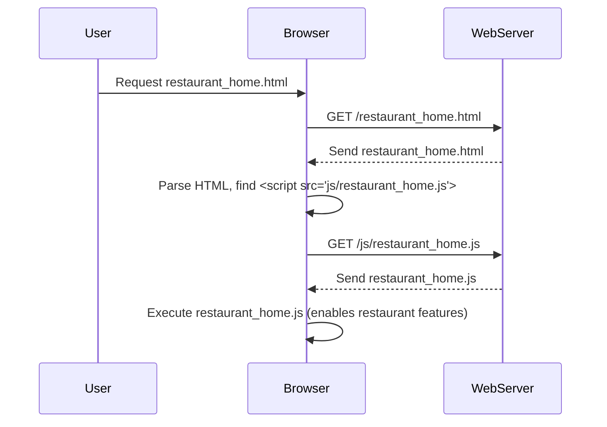

# Chapter 1: Role-Based Interfaces

Welcome to the `foodly` project tutorial! We're excited to have you onboard. In this first chapter, we'll explore a fundamental concept that shapes how `foodly` works: **Role-Based Interfaces**.

## What's the Big Idea?

Imagine you're building a complex application like `foodly`, a food delivery platform. Who uses it?

1.  **Customers:** They browse restaurants, look at menus, place orders, and track deliveries. (We often call their main page the `index`).
2.  **Restaurants:** They manage their menus, update item availability, view incoming orders, and maybe track earnings.
3.  **Riders:** They see available delivery tasks, accept deliveries, view customer locations, and mark deliveries as complete.
4.  **Support Staff:** They might help customers or restaurants with issues, manage user accounts, or oversee operations.

Clearly, a customer doesn't need to see the restaurant's menu management tools, and a rider doesn't need the customer's ordering interface. Showing *everything* to *everyone* would be confusing and cluttered!

This is where **Role-Based Interfaces** come in.

Think of `foodly` like a fancy multi-tool gadget.

*   If you're a **Customer** wanting to order food (like opening a bottle), you get the "order" tool.
*   If you're a **Restaurant** wanting to update your menu (like tightening a screw), you get the "menu management" tool.
*   If you're a **Rider** needing to manage deliveries (like cutting a wire), you get the "delivery management" tool.

Each user "unfolds" the part of the application specifically designed for their job. In `foodly`, we achieve this by having separate JavaScript (JS) files dedicated to the features needed by each role.

## How `foodly` Uses Roles

In our project structure, you'll notice several JavaScript files within the `js/` directory. Many of these are named based on the user role they serve:

*   `js/index.js` & `js/home.js`: Often used for **Customer** interactions on the main site.
*   `js/restaurant_sign.js`, `js/restaurant_home.js`, `js/restaurant_menu.js`: Used for **Restaurant** login, dashboard, and menu management.
*   `js/rider_sign.js`, `js/rider_home.js`: Used for **Rider** login and delivery tasks.
*   `js/support_sign.js`, `js/support_home.js`: Used for **Support Staff** login and tools.

This separation keeps our code organized. The JavaScript code needed for a restaurant to add a menu item lives in a restaurant-specific file, and the code for a customer to browse items lives in a customer-specific file.

## Example: Signing In / Signing Up

Let's look at a simple task: handling login or signup errors. You might think this is the same for everyone, and sometimes the code looks very similar initially.

Here's a snippet from `js/support_sign.js`:

```javascript
// Get potential error messages from the HTML page
var log_error = document.getElementById("log_error_msg").innerHTML;
var sign_error = document.getElementById("sign_error_msg").innerHTML;

// If there's a login error message...
if (log_error == "incorrect email or password") {
	// ...find the login pop-up window...
	var log_pop = document.getElementById('id01');
	// ...and make it visible.
	log_pop.style.display = "block";
}

// If there's a sign-up error message...
if (sign_error == "email already exists") {
	// ...find the sign-up pop-up window...
	var sign_pop = document.getElementById('id02');
	// ...and make it visible.
	sign_pop.style.display = "block";
}
```

This code checks if specific error messages (like "incorrect email or password") exist on the web page (likely hidden within HTML elements with IDs `log_error_msg` or `sign_error_msg`). If an error message is found, it makes the corresponding login (`id01`) or signup (`id02`) pop-up window appear so the user can see the error and try again.

You'll find *almost identical* code in `js/restaurant_sign.js`, `js/rider_sign.js`, and `js/index.js` (for customers).

**Why keep them separate if they are so similar?**

*   **Future Flexibility:** While they look similar *now*, we might want different sign-up steps or error messages for a Restaurant compared to a Customer later. Separating the files makes adding role-specific logic easier in the future without breaking things for other roles.
*   **Clarity:** It clearly signals that this code belongs to the support sign-in/up process, even if it shares logic with others.

We'll explore how this feedback mechanism works in more detail in the next chapter: [User Authentication Feedback](02_user_authentication_feedback.md).

## Example: Role-Specific Features

The real power comes when roles have unique tasks.

**Restaurant: Adding Menu Items**

A restaurant needs to add items to its menu. The `js/restaurant_home.js` file contains code for this:

```javascript
// Counter for unique item fields
var item = 1;

function add_fields() {
	item++; // Increment the counter
	// Find the container for item fields in the HTML
   	var objTo = document.getElementById('item_fileds');
	// Create a new HTML division (div) element
   	var divtest = document.createElement("div");
	// Fill the new div with input fields for a menu item
   	divtest.innerHTML = '<div class="label">Item ' + item +
        ':</div><div class="content"><span>item name:<input type="text" name="item_name[]"/></span> ' +
        '<span>Price: <input type="text" name="item_price[]" /></span> ' +
        '<span>Discount: <input type="text" name="item_discount[]" /></span> ' +
        '<span>Description: <input type="text" name="item_desc[]" /></span></div>';
    // Add the new div (with input fields) to the container
    objTo.appendChild(divtest);
}
```

This `add_fields` function creates new input boxes on the restaurant's dashboard page, allowing them to enter details like item name, price, discount, and description for each new menu item they want to add.

**Customer: Using a Chat Box**

A customer visiting the site (`home.js`) might need a way to contact support.

```javascript
// Function to show or hide the chat box element
function show_chat_box(){
	// Find the chat box element in the HTML
	var chat_box=document.getElementById('chat-box');
	// Check if it's currently hidden
	if(chat_box.style.display=="none")
		// If hidden, make it visible (block)
		chat_box.style.display='block';
	else
		// If visible, hide it
		chat_box.style.display='none';
}
```

This `show_chat_box` function toggles the visibility of a chat interface, something specifically useful for a customer, but not typically needed directly within the restaurant's menu management screen.

These examples show how different JavaScript files provide specific functionalities tailored to the role of the user interacting with that part of the application.

## How It Works Under the Hood

So, how does the browser know which JavaScript file to load? It's based on the HTML page being viewed.

1.  When a user logs in or navigates the site, the web server sends back an HTML page designed for their role (e.g., `restaurant_home.html` for a restaurant owner, `index.html` for a customer).
2.  Inside that specific HTML file, there are `<script>` tags. These tags tell the browser which JavaScript files to download and run.
3.  The `restaurant_home.html` page will include `<script src="js/restaurant_home.js"></script>`, while the main customer page (`index.html` or `home.html`) might include `<script src="js/home.js"></script>`.

Here's a simplified flow:



**Simplified HTML Example (`restaurant_home.html`):**

```html
<!DOCTYPE html>
<html>
<head>
    <title>Restaurant Dashboard</title>
    <!-- Other meta tags, CSS links, etc. -->
</head>
<body>
    <h1>Manage Your Menu</h1>
    <!-- Button to trigger the JS function -->
    <button onclick="add_fields()">Add New Menu Item</button>
    <!-- Container where new item fields will be added -->
    <div id="item_fileds"></div>

    <!-- Other restaurant-specific HTML content -->

    <!-- Crucially, include the JS for restaurant functions -->
    <script src="js/restaurant_home.js"></script>
    <!-- May include other shared JS files too -->
</body>
</html>
```

This HTML page *only* includes the JavaScript relevant to the restaurant's tasks. It doesn't load `rider_home.js` or `support_home.js` because the restaurant user doesn't need those features.

## Conclusion

In this chapter, we learned about **Role-Based Interfaces** in `foodly`. This means we structure our application and its JavaScript code to cater specifically to the different types of users: customers, restaurants, riders, and support staff. We use separate JS files (`index.js`, `restaurant_home.js`, `rider_home.js`, etc.) to keep features organized and relevant to each role. This approach makes the codebase cleaner, easier to manage, and allows us to tailor the user experience effectively.

Now that we understand how `foodly` presents different interfaces based on roles, let's dive into how we provide feedback to users during common actions like logging in or signing up.

Next up: [User Authentication Feedback](02_user_authentication_feedback.md)

---

