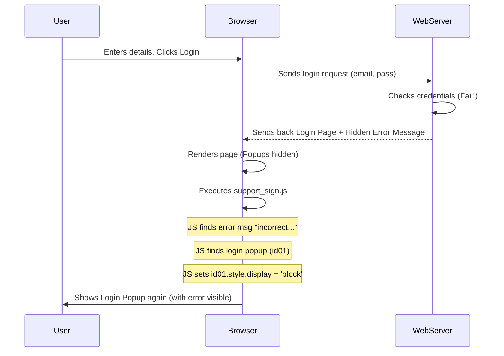

# Chapter 2: User Authentication Feedback

Welcome back! In [Chapter 1: Role-Based Interfaces](01_role_based_interfaces.md), we saw how `foodly` tailors its interface based on who is using it (Customer, Restaurant, Rider, Support) and looked briefly at how similar code handles login/signup errors across these different roles. Now, let's dive deeper into that specific mechanism: **User Authentication Feedback**.

## Why Do We Need Feedback?

Imagine using an ATM. You put in your card and type your PIN. What if you type the wrong PIN? The ATM doesn't just silently do nothing. It shows a message like "Incorrect PIN. Please try again." This immediate feedback tells you exactly what went wrong and what to do next.

Now, think about logging into `foodly`. You type your email and password and click "Login". If you typed the wrong password, what should happen?

*   **Bad:** The page just reloads, and you're still looking at the login form, confused. Did it work? Did I make a mistake?
*   **Good:** The login form stays visible, and a clear message appears: "Incorrect email or password."

This is **User Authentication Feedback**. It's about clearly communicating the result of login or sign-up attempts back to the user, especially when things go wrong. Without it, users get frustrated and might give up!

## How `foodly` Provides Feedback

In `foodly`, when you try to log in or sign up, your details are sent to the web server. The server checks them (e.g., is the password correct? does this email already exist?).

*   If everything is okay, the server sends you to your dashboard (like `restaurant_home.html`).
*   If something is wrong, the server usually sends you *back* to the page with the login/signup form. But critically, it also embeds a small, hidden message within the HTML of that page, describing the error.

Our job on the *browser side* (using JavaScript) is to:

1.  Check if one of these hidden error messages exists when the page loads.
2.  If an error message *is* found, make the login or signup popup window visible again so the user can see the message and correct their mistake.

Think of it like our JavaScript code is looking for a secret note (the error message) left by the server. If it finds the note, it opens the right window (the login or signup popup) to show it to the user.

## Looking at the Code

Remember the code snippets from Chapter 1? They were nearly identical across `js/index.js` (for customers), `js/restaurant_sign.js`, `js/rider_sign.js`, and `js/support_sign.js`. Let's look at one again, for example, from `js/support_sign.js`:

```javascript
// 1. Find potential hidden error messages in the HTML
var log_error = document.getElementById("log_error_msg").innerHTML;
var sign_error = document.getElementById("sign_error_msg").innerHTML;

// 2. Check if there's a specific login error message
if (log_error == "incorrect email or password") {
	// 3. Find the login pop-up window element
	var log_pop = document.getElementById('id01');
	// 4. Make the login pop-up visible
	log_pop.style.display = "block";
}   

// 5. Check if there's a specific sign-up error message
if (sign_error == "email already exists") {
	// 6. Find the sign-up pop-up window element
	var sign_pop = document.getElementById('id02');
	// 7. Make the sign-up pop-up visible
	sign_pop.style.display = "block";
}
```

Let's break this down step-by-step for beginners:

1.  `document.getElementById("some_id")`: This is like asking the web page, "Hey, find the HTML element that has the special label (ID) 'some_id'." In our case, we're looking for elements with IDs `log_error_msg` and `sign_error_msg`. These are likely hidden containers where the server puts error text.
    `.innerHTML`: Once we find the element, `.innerHTML` grabs the text *inside* that HTML element. So, `log_error` now holds the actual error message text (or is empty if there's no error).
2.  `if (log_error == "incorrect email or password")`: This checks if the text we found in `log_error_msg` exactly matches the string "incorrect email or password".
3.  `document.getElementById('id01')`: If the login error matches, we then find the HTML element representing the entire login popup window (which likely has the ID `id01`).
4.  `log_pop.style.display = "block";`: This is the magic! HTML elements can be hidden or shown using CSS styles. `display: none;` usually means hidden. `display: block;` usually means visible. This line changes the style of the login popup (`log_pop`) to make it appear on the screen.
5.  `if (sign_error == "email already exists")`: Similarly, this checks if the text from the `sign_error_msg` element matches "email already exists".
6.  `document.getElementById('id02')`: If the sign-up error matches, we find the sign-up popup window (likely with ID `id02`).
7.  `sign_pop.style.display = "block";`: And this line makes the sign-up popup visible.

So, this simple script checks for known error messages embedded in the page by the server and makes the correct popup visible if an error is detected.

## Under the Hood: The Feedback Loop

How does this all fit together? Let's trace a failed login attempt:

1.  **User Action:** You fill in the login form (ID `id01`) on `support_login.html` and click "Login".
2.  **Browser Request:** The browser sends your email and password to the `foodly` Web Server.
3.  **Server Processing:** The Server checks the details against its database. It finds the password is wrong.
4.  **Server Response:** Instead of sending the support dashboard, the Server sends back the *same* `support_login.html` page. BUT, it includes the error message inside a normally hidden HTML element.

    *Simplified HTML snippet sent back by the server:*
    ```html
    <!-- ... other HTML ... -->

    <!-- The login form popup (initially hidden via CSS) -->
    <div id="id01" style="display: none;">
        <h2>Login Form</h2>
        <!-- ... input fields ... -->
    </div>

    <!-- The signup form popup (initially hidden via CSS) -->
    <div id="id02" style="display: none;">
        <h2>Sign Up Form</h2>
        <!-- ... input fields ... -->
    </div>

    <!-- Hidden element containing the login error from the server -->
    <div id="log_error_msg" style="display: none;">incorrect email or password</div>
    <!-- Hidden element for signup errors (empty this time) -->
    <div id="sign_error_msg" style="display: none;"></div>

    <!-- Include the JavaScript file -->
    <script src="js/support_sign.js"></script>

    <!-- ... rest of HTML ... -->
    ```
5.  **Browser Rendering:** The browser receives `support_login.html`. It starts displaying the page. The login (`id01`) and signup (`id02`) popups are initially hidden because of their CSS styles (`display: none;`). The error messages are also hidden.
6.  **JavaScript Execution:** The browser sees `<script src="js/support_sign.js"></script>` and runs our JavaScript code.
7.  **Feedback Display:**
    *   The script reads "incorrect email or password" from the hidden `log_error_msg` element.
    *   The `if` condition `(log_error == "incorrect email or password")` becomes true.
    *   The script finds the login popup element (`id01`).
    *   The script changes its style: `log_pop.style.display = "block";`.
    *   **Result:** The login popup (`id01`) suddenly appears on the screen, showing the form again, and usually, the error message itself is also displayed near the input fields (handled by other parts of the HTML/CSS not shown in the JS snippet).

Here's a simplified diagram of that flow:



This simple mechanism ensures users aren't left guessing when something goes wrong during login or signup.

## Conclusion

In this chapter, we learned about the importance of **User Authentication Feedback**. We saw how `foodly` uses simple JavaScript in files like `support_sign.js` to:

1.  Read hidden error messages sent back by the server within the HTML.
2.  Check if these messages match known error conditions (like "incorrect email or password").
3.  Make the relevant login (`id01`) or signup (`id02`) popup visible again using `style.display = "block"`.

This provides clear, immediate feedback to the user, improving their experience, just like the helpful messages on an ATM screen. Even though the code looks similar across different roles (Customer, Restaurant, etc.) right now, keeping it in separate role-based files ([Chapter 1: Role-Based Interfaces](01_role_based_interfaces.md)) allows for future customization.

Now that we understand how users get feedback when logging in, let's explore how different roles perform unique actions once they *are* logged in.

Next up: [Dynamic Item Entry](03_dynamic_item_entry.md)

---

