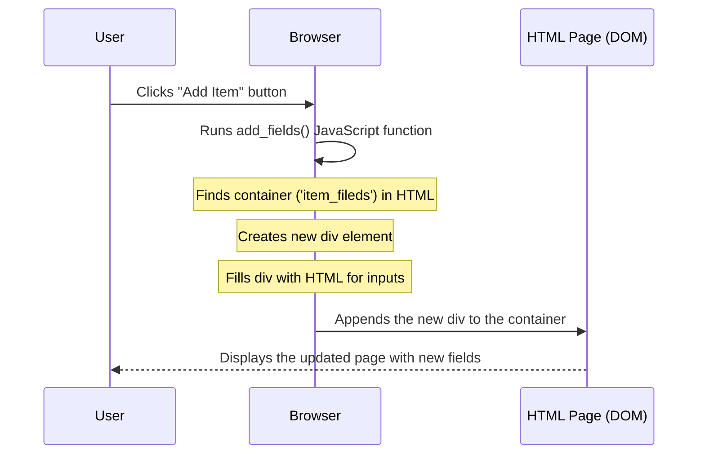

# Chapter 3: Dynamic Item Entry

Welcome back! In [Chapter 2: User Authentication Feedback](02_user_authentication_feedback.md), we saw how `foodly` provides important messages to users when they log in or sign up. Now, let's explore another interactive feature that makes `foodly` user-friendly, especially for roles like Restaurant owners: **Dynamic Item Entry**.

## What's the Problem?

Imagine you're a restaurant owner using `foodly` to add your menu items. You might have 5 items, or you might have 50! How can we design a form that works well for both?

*   **Option 1: A huge form with 50 empty slots?** That would look intimidating and messy if you only have a few items.
*   **Option 2: A form with only one slot, making you save and reload the page for every single item?** That would be incredibly slow and frustrating!

Neither of these is ideal. We need a way for the form to *grow* as the user needs it. If you need to add another menu item, you should be able to do it instantly, without waiting for the page to reload.

This is where **Dynamic Item Entry** comes in.

## What is Dynamic Item Entry?

Think of it like a magical, infinitely expandable piece of paper. You start with space to write down one thing (like a menu item's name, price, and description). If you need to add another item, you just tap a button labeled "Add Item," and *poof* – a new set of blank fields appears right below the last one, ready for you to fill in. You can keep doing this as many times as you need!

**Key Idea:** Dynamic Item Entry allows users to add multiple sets of input fields (like for menu items, donation details, etc.) to a form *on the fly*, directly within their web browser, without needing to reload the entire webpage.

This is incredibly useful for managing lists where you don't know the exact number of items beforehand.

## How `foodly` Uses Dynamic Item Entry

We use this technique in a few places in `foodly`:

1.  **Restaurant Menu Management (`js/restaurant_home.js`):** When a restaurant owner wants to add items to their menu, they can click a button to add fields for each new dish (name, price, discount, description).
2.  **Food Donation (`js/food_donation.js`):** When a user is donating surplus food, they might have multiple types of items to list. They can dynamically add fields for each item (name, quantity).

Let's look at the JavaScript code that makes this magic happen.

## Code Example: Adding Restaurant Menu Items

In the `js/restaurant_home.js` file (which controls features for the restaurant's dashboard, as we learned in [Chapter 1: Role-Based Interfaces](01_role_based_interfaces.md)), we find a function called `add_fields`:

```javascript
// Keep track of how many items we've added
var item = 1;

function add_fields() {
    // Increment the counter for the next item
	item++;
    // 1. Find the container on the HTML page where items go
   	var objTo = document.getElementById('item_fileds');
    // 2. Create a new, empty 'box' (a div element) in memory
   	var divtest = document.createElement("div");
    // 3. Fill the new box with HTML input fields for one item
   	divtest.innerHTML = '<div class="label">Item ' + item +':</div><div class="content"><span>item name:<input type="text" name="item_name[]"/></span> <span>Price: <input type="text" name="item_price[]" /><span> Discount: <input type="text" name="item_discount[]" /></span></span> <span>Description: <input type="text" name="item_desc[]" /></span></div>';
    // 4. Attach the new box (with its fields) to the container on the page
    objTo.appendChild(divtest);
}
```

Let's break this down simply:

*   `var item = 1;`: This is just a counter variable. It starts at 1. We use it to label the items ("Item 2:", "Item 3:", etc.) as we add them.
*   `item++;`: Each time the `add_fields` function runs (because the user clicked the "Add Item" button), we increase the counter.
*   `document.getElementById('item_fileds')`: This tells the browser: "Find the special area on the HTML page that has the ID `item_fileds`. This is where we want to put the new input fields." Let's call this the `container`.
*   `document.createElement("div")`: This tells the browser: "Create a new, blank HTML division (`<div>`) element." Think of it as creating an empty cardboard box in the browser's memory.
*   `divtest.innerHTML = '...';`: This is the cool part. We take our empty box (`divtest`) and stuff it full of HTML code. This HTML code defines the input fields for *one* menu item:
    *   A label like "Item 2:" (using the `item` counter).
    *   An input field for the item's name (`<input type="text" name="item_name[]"/>`).
    *   An input field for the price (`name="item_price[]"`).
    *   An input field for the discount (`name="item_discount[]"`).
    *   An input field for the description (`name="item_desc[]"`).
    *   **Why `name="item_name[]"`?** The `[]` at the end of the `name` is important! It tells the server later (when the form is submitted) that there might be *multiple* values for `item_name`, `item_price`, etc., and they should be treated as a list.
*   `objTo.appendChild(divtest);`: This tells the browser: "Take the new box (`divtest`), which now contains all the input fields, and place it inside the `container` (`objTo`) that we found on the page."

**What happens visually?** When the user clicks the "Add Item" button, this `add_fields` function runs, and instantly, a new row of input fields for Name, Price, Discount, and Description appears below the previous one on their screen! No page reload needed.

## Code Example: Adding Food Donation Items

Now let's look at the `js/food_donation.js` file. It also has an `add_fields` function, and look how similar it is!

```javascript
// Counter for donation items
var item = 1;

function add_fields() {
	item++; // Increment counter
    // 1. Find the container
   	var objTo = document.getElementById('item_fileds'); // Same ID!
    // 2. Create a new box (div)
   	var divtest = document.createElement("div");
    // 3. Fill the box with fields for one donation item
   	divtest.innerHTML = '<div class="label">Item ' + item +':</div><div class="content"><span>item name:<input type="text" name="item_name[]"/></span> <span>Quantity: <input type="text" name="item_price[]" /><span></div>'; // Different fields!
    // 4. Attach the new box to the container
    objTo.appendChild(divtest);
}
```

It follows the *exact same pattern*: find the container, create a new element, fill it with HTML for the inputs, and append it to the container.

The only real difference is step 3 (`divtest.innerHTML = ...`): the HTML string is simpler because donation items only need a `name` and `quantity` (notice it still uses `name="item_name[]"` and `name="item_price[]"` - the actual `name` attribute might be better named `item_quantity[]` here, but the principle is the same).

This shows how the *mechanism* of dynamic item entry is reusable, even if the specific fields being added are different.

## How It Works Under the Hood

Let's visualize the process when a user clicks the "Add Item" button on the restaurant menu page:

1.  **User Action:** The user clicks the button.
2.  **HTML Trigger:** The button in the HTML likely looks something like this:
    ```html
    <button type="button" onclick="add_fields()">Add New Menu Item</button>
    ```
    The `onclick="add_fields()"` part tells the browser to run our JavaScript function when the button is clicked.
3.  **JavaScript Execution:** The browser finds and runs the `add_fields()` function from `js/restaurant_home.js`.
4.  **Finding the Target:** The script uses `document.getElementById('item_fileds')` to locate the container `div` in the HTML page where new items should be added.
    ```html
    <!-- Container where new item fields will appear -->
    <div id="item_fileds">
        <!-- Initially might contain the fields for Item 1 -->
        <div>...fields for Item 1...</div>
        <!-- New items will be added here -->
    </div>
    ```
5.  **Creating New Content:** The script uses `document.createElement('div')` and `innerHTML` to build the HTML for the new set of input fields *in memory*.
6.  **Updating the Page:** The script uses `appendChild()` to add the newly created element (with its input fields) to the `item_fileds` container *directly on the live web page*.
7.  **User Sees Result:** The user instantly sees the new set of fields appear on the page, ready to be filled out. The page didn't reload.

Here's a simplified diagram:



This process of JavaScript directly manipulating the structure and content of the HTML page after it has loaded is often called **DOM Manipulation** (Document Object Model), but you can just think of it as "JavaScript changing the live web page."

## Conclusion

In this chapter, we learned about **Dynamic Item Entry**, a powerful technique used in `foodly` to create user-friendly forms that can grow as needed. We saw how clicking a button can trigger simple JavaScript functions (`add_fields`) in files like `js/restaurant_home.js` and `js/food_donation.js` to:

1.  Find a specific location (`div`) on the HTML page.
2.  Create new HTML elements (like `div`s containing `input` fields).
3.  Add these new elements directly to the page using `appendChild`.

This allows users to add multiple menu items or donation entries easily without annoying page reloads, making the interface much smoother.

Now that we've seen how we can dynamically add form elements, let's look at another common UI element that enhances user interaction in `foodly`: dropdown menus.

Next up: [UI Dropdown Component](04_ui_dropdown_component.md)

---

