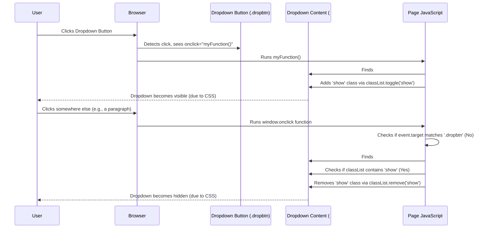

# Chapter 4: UI Dropdown Component

Hi there! In the previous chapter, [Chapter 3: Dynamic Item Entry](03_dynamic_item_entry.md), we saw how `foodly` allows users to add form fields on the fly without reloading the page. Now, let's explore another common interactive element you'll see across the web: **UI Dropdown Components**.

## What's the Problem? Keeping Things Tidy!

Imagine the top corner of the `foodly` website after you log in. You might need links for "Your Profile," "Order History," "Settings," and "Logout." If we just put all those links directly in the header, it could start looking cluttered, especially on smaller screens!

We need a way to keep these options organized and hidden until the user actually needs them.

## What is a UI Dropdown Component?

A UI Dropdown Component is exactly what we need! It's like a retractable blind for your window:

*   **The Button:** You have a small button or link (like the cord on the blind).
*   **The Content:** You have a list of options hidden away (like the view outside the window when the blind is up).
*   **Action 1: Click the Button:** You click the button (pull the cord), and the list of options appears below or nearby (the blind lowers, revealing the view).
*   **Action 2: Click Elsewhere:** You click anywhere else on the page outside the revealed list (release the cord), and the list hides away again (the blind snaps back up).

This simple interaction provides a clean way to tuck away actions or navigation links until they are needed.

## How `foodly` Uses Dropdowns

You'll find this pattern used in `foodly` in a few places. A common example is the user menu often found in the top-right corner of the page after logging in. Clicking on your username or a profile icon might reveal options like "Logout" or "Settings".

We have JavaScript code in files like `js/home.js`, `js/restaurant_home.js`, and `js/restaurant_menu.js` that handles this show/hide logic. Let's look at how it works.

## How It Works: The JavaScript Magic

Making a dropdown appear and disappear involves two main pieces of JavaScript logic:

1.  **Toggling Visibility:** Making the dropdown show up when you click the button and hide if you click the button again.
2.  **Closing on Outside Click:** Making the dropdown hide if it's open and you click anywhere *else* on the page.

### 1. Toggling Visibility with `myFunction`

Let's look at a function commonly used in `foodly` for this, often named `myFunction`. You can find versions of this in `js/home.js`, `js/restaurant_home.js`, and `js/restaurant_menu.js`.

```javascript
// This function runs when the dropdown button is clicked
function myFunction() {
    // 1. Find the dropdown content element (usually a div with id="myDropdown")
    var dropdownContent = document.getElementById("myDropdown");
    // 2. Add or remove the 'show' class
    dropdownContent.classList.toggle("show");
}
```

Let's break it down:

1.  `document.getElementById("myDropdown")`: This finds the hidden box (usually an HTML `<div>`) that holds our dropdown links (e.g., "Logout", "Settings"). We assume this box has the ID `myDropdown`.
2.  `dropdownContent.classList.toggle("show")`: This is the core trick!
    *   HTML elements can have "classes," which are like labels used by CSS (Cascading Style Sheets) to control how things look (color, size, visibility).
    *   We assume our CSS is set up so that the `#myDropdown` box is hidden by default, but *visible* when it has the class `show`.
    *   `classList.toggle("show")` does this:
        *   If the element *doesn't* have the `show` class, it adds it (making the dropdown appear).
        *   If the element *already has* the `show` class, it removes it (making the dropdown hide).

**In simple terms:** Clicking the button runs this function, which flips the `show` label on or off for the dropdown content, making it appear or disappear based on CSS rules.

**HTML Connection:** This JavaScript function needs to be linked to the button in the HTML, usually like this:

```html
<!-- The button that triggers the dropdown -->
<button onclick="myFunction()" class="dropbtn">User Menu</button>

<!-- The dropdown content (initially hidden by CSS) -->
<div id="myDropdown" class="dropdown-content">
  <a href="#">Settings</a>
  <a href="#">Logout</a>
</div>
```

When the `<button>` is clicked, the `onclick="myFunction()"` part tells the browser to run our JavaScript function.

### 2. Closing on Outside Click with `window.onclick`

Okay, so clicking the button shows/hides the menu. But we also want it to hide if the user clicks *anywhere else*. This requires a different piece of code, also found in the same JavaScript files.

```javascript
// This function runs whenever *anywhere* on the window is clicked
window.onclick = function(event) {
  // 1. Check if the place clicked *wasn't* the dropdown button
  if (!event.target.matches('.dropbtn')) {
    // 2. Find the dropdown content element again
    var dropdownContent = document.getElementById("myDropdown");
    // 3. Check if the dropdown content is currently being shown
    if (dropdownContent.classList.contains('show')) {
      // 4. If it is shown, remove the 'show' class to hide it
      dropdownContent.classList.remove('show');
    }
  }
}
```

Let's walk through this:

1.  `window.onclick = function(event)`: This sets up a listener. It says, "Hey browser, whenever *any* click happens anywhere in the window, run this function. Also, give me information about the click (the `event` object)."
2.  `!event.target.matches('.dropbtn')`: This is the crucial check.
    *   `event.target`: This tells us exactly *what element* was clicked.
    *   `.matches('.dropbtn')`: This checks if the clicked element *is* our dropdown button (we assume the button has the class `dropbtn`).
    *   `!`: This means "NOT".
    *   So, the `if` condition is true only if the click happened *somewhere other than* the dropdown button.
3.  `var dropdownContent = document.getElementById("myDropdown")`: We find our dropdown content box again.
4.  `dropdownContent.classList.contains('show')`: We check if the dropdown content currently has the `show` class (meaning it's visible).
5.  `dropdownContent.classList.remove('show')`: If the click was outside the button AND the dropdown is currently visible, this line removes the `show` class, making the dropdown hide according to our CSS rules.

**In simple terms:** If a click happens, this code checks if it was *outside* the dropdown button. If it was, and if the dropdown menu is currently open, it closes the menu. This stops the menu from staying open unexpectedly.

*(Note: The version in `js/home.js` includes some extra lines using `$` which relate to jQuery, a JavaScript library. The code above shows the core vanilla JavaScript logic common to other files like `js/restaurant_menu.js` which achieves the same result).*

## Under the Hood: The Click Journey

Let's trace the sequence of events:

1.  **User clicks the dropdown button (`.dropbtn`)**:
    *   The `onclick` attribute on the button triggers the `myFunction()` JavaScript.
    *   `myFunction()` finds the dropdown content (`#myDropdown`).
    *   `myFunction()` uses `classList.toggle("show")` to add the `show` class.
    *   The browser applies CSS rules associated with the `show` class, making the dropdown content visible.
2.  **User clicks somewhere else on the page (not the button)**:
    *   The `window.onclick` function runs because a click occurred.
    *   It checks `event.target`. Let's say the user clicked on a paragraph (`<p>`).
    *   `event.target.matches('.dropbtn')` is `false` (a paragraph is not the button).
    *   The `if (!false)` condition becomes true.
    *   The code finds the dropdown content (`#myDropdown`).
    *   It checks `classList.contains('show')`. Since the dropdown is open, this is `true`.
    *   The `if (true)` condition is met.
    *   The code runs `classList.remove('show')`.
    *   The browser applies CSS rules, seeing the `show` class is gone, and hides the dropdown content.

Here's a diagram showing the flow when clicking the button, then clicking outside:



## Conclusion

In this chapter, we learned about **UI Dropdown Components**, a neat way to keep interface elements tidy. We saw how `foodly` uses simple JavaScript to:

1.  **Toggle Visibility:** Use a function like `myFunction` connected to a button's `onclick` event to add/remove a CSS class (`show`) on the dropdown content using `classList.toggle()`.
2.  **Close on Outside Click:** Use `window.onclick` to detect clicks anywhere. If the click isn't on the dropdown button (`!event.target.matches('.dropbtn')`) and the dropdown is currently open (`classList.contains('show')`), it removes the `show` class (`classList.remove('show')`) to hide it.

This combination provides the familiar dropdown behavior seen across many websites, enhancing usability by organizing options cleanly.

We've now covered several key front-end concepts in `foodly`, from showing different views based on user roles to handling feedback, dynamic forms, and dropdowns. In the final chapter, we'll switch gears and look at how to get the `foodly` project set up on your own computer so you can start contributing!

Next up: [Project Setup & Contribution Guidelines](05_project_setup___contribution_guidelines.md)

---

