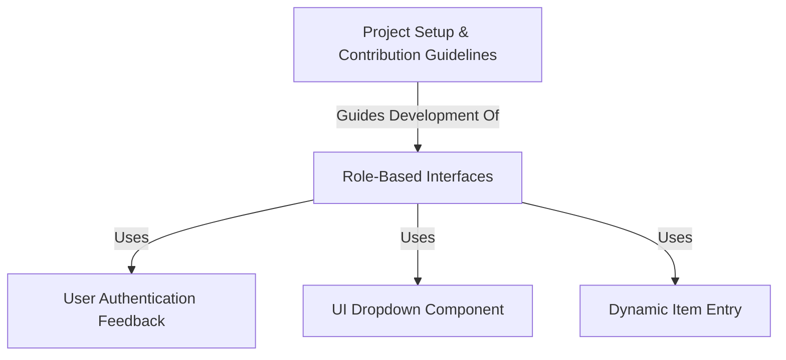

# foodly

**foodly** is a web application built using *PHP and AJAX* primarily for ordering food online.
It also provides separate interfaces for different types of users involved in the food delivery process.
Think of it as a platform connecting **customers** wanting food, **restaurants** preparing it, and **riders** delivering it, with specific tools tailored for each **user role**.

**Source Repository:** [https://github.com/namanvashistha/foodly](https://github.com/namanvashistha/foodly)

## Chapters

1. [Role-Based Interfaces](01_role_based_interfaces.md)
2. [User Authentication Feedback](02_user_authentication_feedback.md)
3. [Dynamic Item Entry](03_dynamic_item_entry.md)
4. [UI Dropdown Component](04_ui_dropdown_component.md)
5. [Project Setup & Contribution Guidelines](05_project_setup___contribution_guidelines.md)

---

